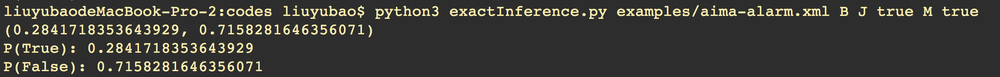
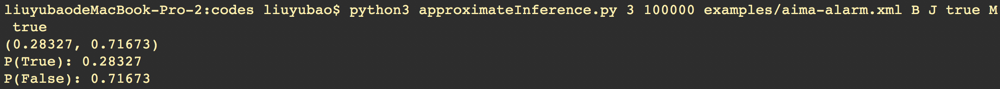
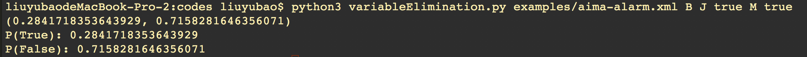

# README for project 3 CSC442

    Yubao Liu
    Nov 23, 2018


## 1.Environment:

    python3.6.7

## 2.File structure:
* xmlParser.py  -- used to parse the BayesNet from a xml
* bayesNet.py  --  Contains the BayesNet and BayesNode class
* probDistribution.py        --  Contains the ProbDist class, used to store the probability distribution
* exactInference.py --  Implemented inference by enumeration algorithm
* approximateInference.py        --  Implemented inference by approximate inference: Rejection, Likelihood, Gibbs sampling
* variableElimination.py --  contains the class of Factor and Implemented variable elimination
* examples -- contains all bayesNet xmls
* writeup
* README


## 3.How to run?
### 3.1 ExactInference
python3 exactInference.py[the .py to run] examples/aima-alarm.xml[the xml dir] B[query] J[evidence] true M[evidence] true

Example: python3 exactInference.py examples/aima-alarm.xml B J true M true

    >>>python3 exactInference.py examples/aima-alarm.xml B J true M true
    (0.2841718353643929, 0.7158281646356071)
    P(True): 0.2841718353643929
    P(False): 0.7158281646356071



### 3.2 ApproximateInference
python3 approximateInference.py.py[the .py to run] 1[sampling method choice: 1-rejection 2-likelihood 3-gibbs] 10000[the number of samples] examples/aima-alarm.xml[the xml dir] B[query] J[evidence] true M[evidence] true

Example: python3 approximateInference.py 3 10000 examples/aima-alarm.xml B J true M true

    >>>python3 approximateInference.py 3 10000 examples/aima-alarm.xml B J true M true
    (0.28327, 0.71673)
    P(True): 0.28327
    P(False): 0.71673



### 3.3 VariableElimination
python3 variableElimination.py[the .py to run] examples/aima-alarm.xml[the xml dir] B[query] J[evidence] true M[evidence] true

Example: python3 variableElimination.py examples/aima-alarm.xml B J true M true

    >>>python3 variableElimination.py examples/aima-alarm.xml B J true M true
    (0.2841718353643929, 0.7158281646356071)
    P(True): 0.2841718353643929
    P(False): 0.7158281646356071



## 4.Important addup for nodes' sequence rearrange
4.1 After email communicating with professor and Lisa Jin, I add some codes to rearrange the bayesnode list to make sure it ordered with parents before children.

I created a "nodeInfoStack" to save the already rearranged nodes. For each itteration, I delete the node in original "nodeInfos" that all parents included in "nodeInfoStack" and correspondly update the "nodeInfoStack". Finally, the "nodeInfos" are ordered with parents before children.

```python

# rearrange the node list to make sure it ordered with parents before children.
nodeInfoStack = []
# first: put nodes with no parents into the stack
for nodeInfo in nodeInfos:
    if len(nodeInfo.getElementsByTagName("GIVEN")) == 0:
        varName = nodeInfo.getElementsByTagName("FOR")[0].childNodes[0].data
        nodeInfoStack.append([varName, nodeInfo])
        nodeInfos.remove(nodeInfo)

while len(nodeInfos) > 0:
    varNameList = [node[0] for node in nodeInfoStack]
    for nodeInfo in nodeInfos:
        varName = nodeInfo.getElementsByTagName("FOR")[0].childNodes[0].data
        allInVarNameList = True
        for givenNode in nodeInfo.getElementsByTagName("GIVEN"):
            if not givenNode.childNodes[0].data in varNameList:
                allInVarNameList = False
                break
        if allInVarNameList:
            nodeInfoStack.append([varName, nodeInfo])
            nodeInfos.remove(nodeInfo)

nodeInfos = [node[1] for node in nodeInfoStack]

```

4.2 Among all xml files in examples, the sequence in aims-alarm.xml and aims-wet-grass.xml are all in order of the bayesNet graph. However, in dog-problem the sequence is not, which means "family-out" node was put after the node "light-on" in xml. As seem in below picture.


After rearranging the nodesSequence, the xmlParser can read the dog-problem xml file successfully. Here are one of the result running on it.

```
>>>python3 exactInference.py examples/dog-problem.xml family-out hear-bark true dog-out true
(0.3413965591289189, 0.6586034408710809)
P(True): 0.3413965591289189
P(False): 0.6586034408710809
the amount of recursion called:  26
the time consumed to caculate:  0.00017881393432617188
```


