# Uncertain and Exact Inference

    Yubao Liu
    Nov 23, 2018

# Table of contents
1. What I did?
2. Environment
3. File structure
4. Representaion
  * 4.1 BayesNode
  * 4.2 BayesNet
  * 4.3 ProbDistribution
5. XML Parser
6. Algorithms
  * 6.1 Enumeration ask
  * 6.2 variable Elimination Ask
  * 6.3 Regiontion sampling
  * 6.4 Likelihood weighting sampling
  * 6.5 Gibbs sampling
7. Algorithms Comparison
  * 7.1 Enumeration and Variable Elimination
  * 7.2 Rejection, Likelyhood weighting and Gibbs sampling
8. Summary


## 1.What I did?
* implemented the representaion of bayesNet
* implemented the inference by enumeration
* implemented parser to parse the BayesNet from a xml
* implemented class to store the probability distribution
* implemented inference by approximate inference: Rejection, Likelihood, Gibbs sampling
* implemented variable elimination
* all the command line parameters codings (main functions)
* testing on all xmls in examples
* created tables and graph to compare the results
* write README


## 2. Environment:

    python3.6.7

## 3. File structure:
* xmlParser.py  -- used to parse the BayesNet from a xml
* bayesNet.py  --  Contains the BayesNet and BayesNode class
* probDistribution.py        --  Contains the ProbDist class, used to store the probability distribution
* exactInference.py --  Implemented inference by enumeration algorithm
* approximateInference.py        --  Implemented inference by approximate inference: Rejection, Likelihood, Gibbs sampling
* variableElimination.py --  contains the class of Factor and Implemented variable elimination
* examples -- contains all bayesNet xmls
* writeup
* README

## 4. Representaion
### 4.1 BayesNode
I created 4 varibles and 2 functions for every bayesian node in class BayesNode.

* self.variable
* self.parents: a sequence of parents node
* self.cpt: the conditional probability table of the node
* self.children: a sequence of children node

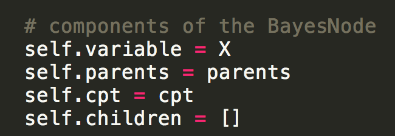

### 4.2 BayesNet
The bayesian network consists of several bayesian node. I used 2 variables "self.nodes" and "self.variables" to represent the whole network. In the class BayesNet, there are 3 functions.

* self.add:  Add a node to the net.
* self.variableNode: Return the node for the variable named var.
* self.variableValues: Return the domain of var.

### 4.3 ProbDistribution
Every node contains a distribution. Here I created 3 variables and 1 function in the class "ProbDist". Importantly, once initialized it with frequences, it will call normalize function to sum values to 1.

* self.prob:  the probability of each variables' value
* self.varName: the name of the variable
* self.values: the values of the variable
* self.normalize(): normalize all values sum to 1.

## 5. XML Parser
5.1 I used xml.dom.minidom package to open the xml.

5.2 Each xml file are corresponding to one specific bayesian network. For each node in the xml, there are 3 important elements in each "DEFINITION". "FOR" corresponds to the variable name. "GIVEN" corresponds to the parents. "TABLE" corresponds to a probability distribution.


5.3 In terms of the "TABLE", the formats are not all the same in 3 xml files. The values are sometimes split by "\n" sometimes "\t" or " ". So I replaced all "\n" and "\t" by " " first and then only left the odd index, which is the cpt evaluated to True.

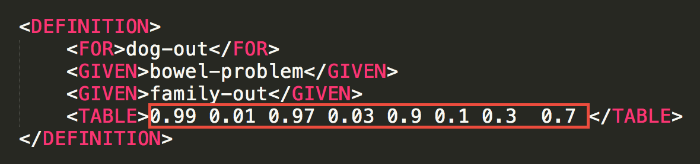
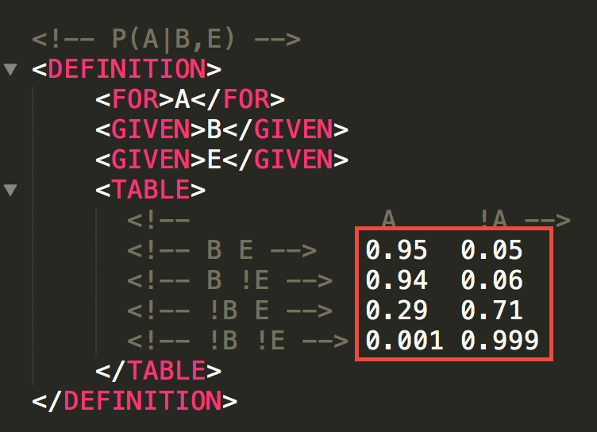

5.4 After email communicating with professor and Lisa Jin, I add some codes to rearrange the bayesnode list to make sure it ordered with parents before children.

I created a "nodeInfoStack" to save the already rearranged nodes. For each itteration, I delete the node in original "nodeInfos" that all parents included in "nodeInfoStack" and correspondly update the "nodeInfoStack". Finally, the "nodeInfos" are ordered with parents before children.

```python

# rearrange the node list to make sure it ordered with parents before children.
nodeInfoStack = []
# first: put nodes with no parents into the stack
for nodeInfo in nodeInfos:
    if len(nodeInfo.getElementsByTagName("GIVEN")) == 0:
        varName = nodeInfo.getElementsByTagName("FOR")[0].childNodes[0].data
        nodeInfoStack.append([varName, nodeInfo])
        nodeInfos.remove(nodeInfo)

while len(nodeInfos) > 0:
    varNameList = [node[0] for node in nodeInfoStack]
    for nodeInfo in nodeInfos:
        varName = nodeInfo.getElementsByTagName("FOR")[0].childNodes[0].data
        allInVarNameList = True
        for givenNode in nodeInfo.getElementsByTagName("GIVEN"):
            if not givenNode.childNodes[0].data in varNameList:
                allInVarNameList = False
                break
        if allInVarNameList:
            nodeInfoStack.append([varName, nodeInfo])
            nodeInfos.remove(nodeInfo)

nodeInfos = [node[1] for node in nodeInfoStack]

```

Among all xml files in examples, the sequence in aims-alarm.xml and aims-wet-grass.xml are all in order of the bayesNet graph. However, in dog-problem the sequence is not, which means "family-out" node was put after the node "light-on" in xml. As seem in below picture.


After rearranging the nodesSequence, the xmlParser can read the dog-problem xml file successfully. Here are one of the result running on it.

```
>>>python3 exactInference.py examples/dog-problem.xml family-out hear-bark true dog-out true
(0.3413965591289189, 0.6586034408710809)
P(True): 0.3413965591289189
P(False): 0.6586034408710809
the amount of recursion called:  26
the time consumed to caculate:  0.00017881393432617188
```

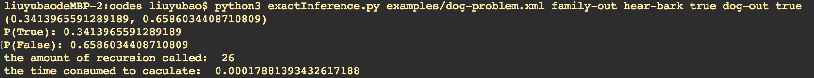


## 6. Algorithms
### 6.1 Enumeration ask
#### 6.1.1 Algorithm explaintion
A Bayesian network gives a complete representation of the full joint distribution. More specifically, the terms P (x, e, y) in the joint distribution can be written as products of conditional probabilities from the network. Therefore, a query can be answered using a Bayesian network by computing sums of products of condi- tional probabilities from the network.


The enumerationAsk algorithm below evaluates the bn BayesNet using depth-first recursion. For every node Y, if it is an evidence varible, just evaluate it using the given value. If Y is a hidden variable, sum the value both it is true and false.

```python
def enumerationAsk(X, e, bn):
    """
    X: the query variable
    e: observed values for variables E
    bn: a BayesNet with variables {X} ⋃ E ⋃ Y /* Y = hidden variables */

    Return the conditional probability distribution of variable X given evidence e, from BayesNet bn.
    Examples:
    >>> enumerationAsk('Burglary', dict(JohnCalls=T, MaryCalls=T), burglary)
    'False: 0.716, True: 0.284'

    """
    Q = ProbDist(X)     # a distribution over X, initially empty
    for xi in bn.variableValues(X):
        Q[xi] = enumerateAll(bn.variables, extend(e, X, xi), bn)
    return Q.normalize()

def enumerateAll(variables, e, bn):
    """
    Returns the sum of those entries in P(variables | e{others})
    consistent with e, where P is the joint distribution represented
    by bn

    Parents must precede children in variables.
    """
    if not variables:       # if EMPTY?(vars) then return 1.0
        return 1.0
    Y, rest = variables[0], variables[1:]   # Y ← FIRST(vars)
    Ynode = bn.variableNode(Y)
    if Y in e:
        return Ynode.pOfValue(e[Y], e) * enumerateAll(rest, e, bn)
    else:
        return sum(Ynode.pOfValue(y, e) * enumerateAll(rest, extend(e, Y, y), bn)
                   for y in bn.variableValues(Y))

```
#### 6.1.2 Performance of the algorithm
```
>>>python3 exactInference.py examples/aima-alarm.xml B J true M true
(0.2841718353643929, 0.7158281646356071)
P(True): 0.2841718353643929
P(False): 0.7158281646356071
the amount of recursion called:  24
the time consumed to caculate:  0.00017905235290527344

```

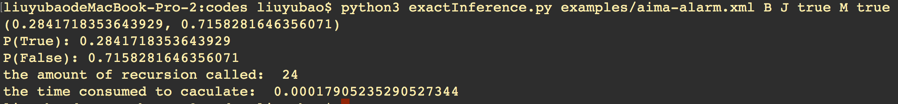
##### 6.1.2.1 Correctness
It is correct. In the aima-alarm.xml example, the result is (0.2841718353643929, 0.7158281646356071).
##### 6.1.2.2 Amount of recursion called
The recursion is called for many times. In the aima-alarm.xml example, the amount of recursion called is 24.
##### 6.1.2.3 Time consumed
It is quick since there is not many varibles. In the aima-alarm.xml example, the time consumed to calculate is 0.00017905235290527344 second.


### 6.2 variable Elimination Ask
#### 6.2.1 Algorithm explaintion
The enumeration algorithm can be improved substantially by eliminating repeated calculations of the kind. The idea is simple: do the calculation once and save the results for later use. This is a form of dynamic programming. Variable elimination works by evaluating expressions in right-to-left order. Intermediate results are stored, and summations over each variable are done only for those portions of the expression that depend on the variable.

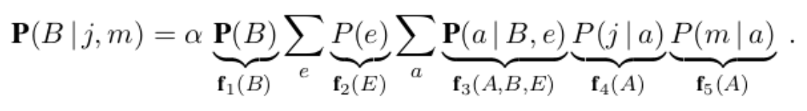

Here I construct a Factor class to represent each factor in the equasion. Here are the usage of some functions.

* def isHidden(var, X, e):  Is var a hidden variable or not?
* def makeFactor(var, e, bn): Return the factor for var in bn's joint distribution given e.
* def sumOut(var, factors, bn): Eliminate var from all factors by summing over its values.

```python
def eliminationAsk(X, e, bn):
    """
    X: the query variable
    e: observed values for variables E
    bn: a Bayesian network specifying joint distribution P(X1, …, Xn)

    Compute bn's P(X|e) by variable elimination.

    >>> eliminationAsk('Burglary', dict(JohnCalls=T, MaryCalls=T), burglary)
    'False: 0.716, True: 0.284'

    """

    factors = []
    for var in reversed(bn.variables):  # Ordered
        factors.append(makeFactor(var, e, bn))
        if isHidden(var, X, e):     # if var is a hidden variable
            factors = sumOut(var, factors, bn)
    return pointwiseProduct(factors, bn).normalize()
```

#### 6.2.2 Performance of the algorithm
```
>>>python3 variableElimination.py examples/aima-alarm.xml B J true M true
(0.2841718353643929, 0.7158281646356071)
P(True): 0.2841718353643929
P(False): 0.7158281646356071
the amount of recursion called:  3
the time consumed to caculate:  0.00027489662170410156
```


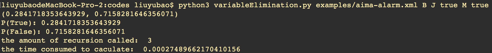
##### 6.2.2.1 Correctness
It is correct. In the aima-alarm.xml example, the result is (0.2841718353643929, 0.7158281646356071).
##### 6.2.2.2 Amount of recursion called
The recursion is called for much less times. In the aima-alarm.xml example, the amount of recursion called is 3.
##### 6.2.2.3 Time consumed
It is quick since there is not many varibles. In the aima-alarm.xml example, the time consumed to calculate is 0.00027489662170410156 second.

### 6.3 Regiontion sampling
#### 6.3.1 Algorithm explaintion
Rejection sampling is a general method for producing samples from a hard-to-sample distribution given an easy-to-sample distribution. In its simplest form, it can be used to compute conditional probabilities that is, to determine P(X |e). First, it generates samples from the prior distribution specified by the network. Then, it rejects all those that do not match the evidence. Finally, the estimate Pˆ(X = x | e) is obtained by counting how often X = x occurs in the remaining samples.


Here in rejectionSampling function, I first created a dict to count the number of each variable's value. After generating samples from the prior distribution specified by the network, it rejects all those that do not match the evidence.

```python
def rejectionSampling(X, e, bn, N=10000):
    """
    X: the query variable
    e: observed values for variables E
    bn: a Bayesian network
    N: the total number of samples to be generated

    Returns the probability distribution of variable X given e in BayesNet bn, using N samples.

    Examples:
    # >>> random.seed(47)
    >>> rejectionSampling('Burglary', dict(JohnCalls=T, MaryCalls=T), burglary, 10000)
    'False: 0.7, True: 0.3'

    """
    counts = {x: 0 for x in bn.variableValues(X)}  # the dict to count the number of each variable's value
    for j in range(N):
        sample = priorSample(bn) # the sample dict from the distribution
        if consistentWith(sample, e):
            counts[sample[X]] += 1
    return ProbDist(X, counts)
```

#### 6.3.2 Performance of the algorithm
```
>>>python3 approximateInference.py 1 1000 examples/aima-alarm.xml B J true M true
(0, 1)
P(True): 0
P(False): 1
the time consumed to caculate:  0.00891423225402832

>>>python3 approximateInference.py 1 10000 examples/aima-alarm.xml B J true M true
(0.4375, 0.5625)
P(True): 0.4375
P(False): 0.5625
the time consumed to caculate:  0.0893242359161377

>>>python3 approximateInference.py 1 100000 examples/aima-alarm.xml B J true M true
(0.30357142857142855, 0.6964285714285714)
P(True): 0.30357142857142855
P(False): 0.6964285714285714
the time consumed to caculate:  0.8825352191925049

>>>python3 approximateInference.py 1 1000000 examples/aima-alarm.xml B J true M true
(0.29571984435797666, 0.7042801556420234)
P(True): 0.29571984435797666
P(False): 0.7042801556420234
the time consumed to caculate:  8.250781774520874

```


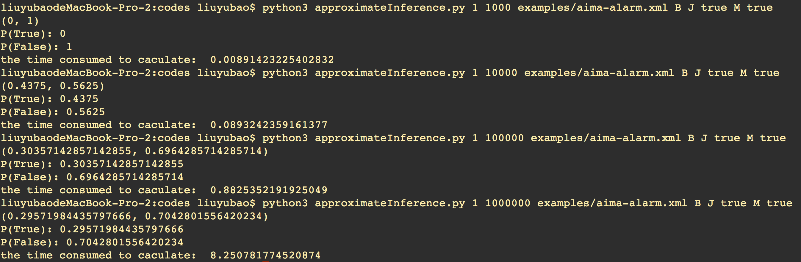
##### 6.3.2.1 Correctness
From the results showed above, when the N is larger, the correctness is improved. But when the N is very large, the result is still not that correct.
* N = 1000: result = (0, 1)
* N = 10000: result = (0.4375, 0.5625)
* N = 100000: result = (0.30357142857142855, 0.6964285714285714)
* N = 1000000: result = (0.29571984435797666, 0.7042801556420234)


##### 6.3.2.2 Time consumed
From the results showed above, when the N is larger, the time consumed is increased. When the N is very large, it need a lot of time.
* N = 1000: time consumed = 0.00891423225402832
* N = 10000: time consumed = 0.0893242359161377
* N = 100000: time consumed = 0.8825352191925049
* N = 1000000: time consumed = 8.250781774520874


### 6.4 Likelihood weighting sampling
#### 6.4.1 Algorithm explaintion
Likelihood weighting avoids the inefficiency of rejection sampling by generating only events that are consistent with the evidence e. It is a particular instance of the general statistical technique of importance sampling, tailored for inference in Bayesian networks.

Here in likelihoodWeighting function, I first created a dict to count the number of each variable's value and than called weightedSample function to get both event and weight of each sample. In weightedSample function, if Xi is evidenc variable, w ← w × P(Xi = xi | parents(Xi)). Else, x[i] ← a random sample from P(Xi | parents(Xi)). LikelihoodWeighting fixes the values for the evidence variables E and samples only the nonevidence variables. This guarantees that each event generated is consistent with the evidence.

```python
def likelihoodWeighting(X, e, bn, N=10000):
    """
    X: the query variable
    e: observed values for variables E
    bn: a Bayesian network specifying joint distribution P(X1, …, Xn)
    N: the total number of samples to be generated

    Returns the probability distribution of variable X given e in BayesNet bn.  
    # >>> random.seed(1017)
    >>> likelihoodWeighting('Burglary', dict(JohnCalls=T, MaryCalls=T), burglary, 10000)
    'False: 0.702, True: 0.298'

    """
    W = {x: 0 for x in bn.variableValues(X)}   # the dict to count the number of each variable's value
    for j in range(N):
        sample, weight = weightedSample(bn, e)  # boldface x, w in [Figure 14.15]
        W[sample[X]] += weight
    return ProbDist(X, W)

def weightedSample(bn, e):
    """
    Returns the event and its weight, the likelihood that the event
    accords to the evidence.
    """
    w = 1
    event = dict(e)  # the event initial with evidence value
    for node in bn.nodes:
        Xi = node.variable
        if Xi in e:
            w *= node.pOfValue(e[Xi], event)     # w ← w × P(Xi = xi | parents(Xi))
        else:
            event[Xi] = node.sample(event)      # x[i] ← a random sample from P(Xi | parents(Xi))
    return event, w
```

#### 6.4.2 Performance of the algorithm
```
>>>python3 approximateInference.py 2 1000 examples/aima-alarm.xml B J true M true
(0.2637638685367446, 0.7362361314632554)
P(True): 0.2637638685367446
P(False): 0.7362361314632554
the time consumed to caculate:  0.007827281951904297

>>>python3 approximateInference.py 2 10000 examples/aima-alarm.xml B J true M true
(0.21674442604974414, 0.7832555739502558)
P(True): 0.21674442604974414
P(False): 0.7832555739502558
the time consumed to caculate:  0.07909202575683594

>>>python3 approximateInference.py 2 100000 examples/aima-alarm.xml B J true M true
(0.25226935221463626, 0.7477306477853637)
P(True): 0.25226935221463626
P(False): 0.7477306477853637
the time consumed to caculate:  0.8009500503540039

>>>python3 approximateInference.py 2 1000000 examples/aima-alarm.xml B J true M true
(0.2772513828511506, 0.7227486171488494)
P(True): 0.2772513828511506
P(False): 0.7227486171488494
the time consumed to caculate:  8.189713954925537

```

##### 6.4.2.1 Correctness
From the results showed above, when the N is larger, the correctness is not changed a lot. When the N is small, the result is even very near to correct answer.
* N = 1000: result = (0.2637638685367446, 0.7362361314632554)
* N = 10000: result = (0.21674442604974414, 0.7832555739502558)
* N = 100000: result = (0.25226935221463626, 0.7477306477853637)
* N = 1000000: result = (0.2772513828511506, 0.7227486171488494)


##### 6.4.2.2 Time consumed
From the results showed above, when the N is larger, the time consumed is increased. When the N is very large, it need a lot of time.
* N = 1000: time consumed = 0.007827281951904297
* N = 10000: time consumed = 0.07909202575683594
* N = 100000: time consumed = 0.8825352191925049
* N = 1000000: time consumed = 8.189713954925537

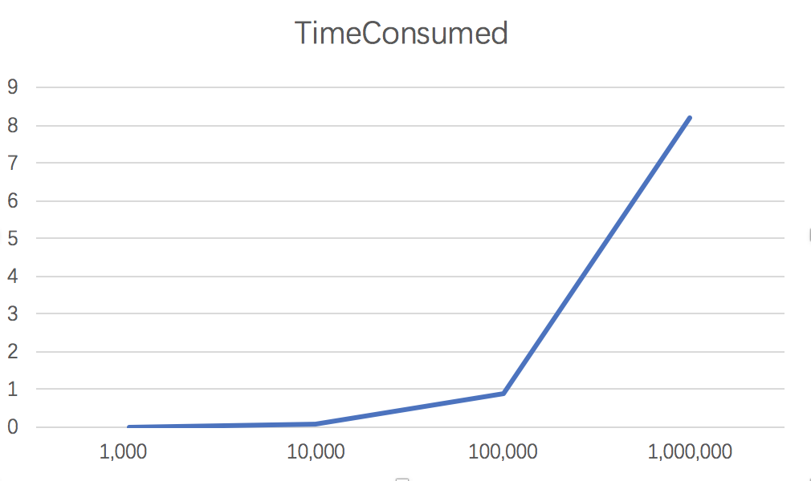

### 6.5 Gibbs sampling
#### 6.5.1 Algorithm explaintion
The Gibbs sampling algorithm for Bayesian networks starts with an arbitrary state (with the evidence variables fixed at their observed values) and generates a next state by randomly sampling a value for one of the nonevidence variables Xi. The sampling for Xi is done conditioned on the current values of the variables in the Markov blanket of Xi. The algorithm therefore wanders randomly around the state space—the space of possible complete assignments—flipping one variable at a time, but keeping the evidence variables fixed.

Here in gibbsAsk function, I first created a dict to count the number of each variable's value and Z to store the nonevidence variables in bn. For every nonevidence variable, set its value in xState by sampling from P(Zi | mb(Zi)).

After generating samples from the prior distribution specified by the network, it rejects all those that do not match the evidence. The markovBlanketSample function returns a sample from P(X | mb) where mb denotes that the variables in the Markov blanket of X take their values from event e (which must assign a value to each). The Markov blanket of X is X's parents, children, and children's parents.

```python
def gibbsAsk(X, e, bn, N=1000):
    """
    X: the query variable
    e: observed values for variables E
    bn: a Bayesian network specifying joint distribution P(X1, …, Xn)
    N: the total number of samples to be generated

    """

    counts = {x: 0 for x in bn.variableValues(X)}  # the dict to count the number of each variable's value
    Z = [var for var in bn.variables if var not in e]   # Z: the nonevidence variables in bn
    xState = dict(e) # the current state of the network, initially copied from e
    for Zi in Z:
        xState[Zi] = random.choice(bn.variableValues(Zi))
    for j in range(N):
        for Zi in Z:
            xState[Zi] = markovBlanketSample(Zi, xState, bn)  # set the value of Zi in xState by sampling from P(Zi | mb(Zi))
            counts[xState[X]] += 1
    return ProbDist(X, counts)


def markovBlanketSample(X, e, bn):
    """
    Return a sample from P(X | mb) where mb denotes that the
    variables in the Markov blanket of X take their values from event
    e (which must assign a value to each). The Markov blanket of X is
    X's parents, children, and children's parents.

    """
    Xnode = bn.variableNode(X)
    Q = ProbDist(X)
    for xi in bn.variableValues(X):
        ei = extend(e, X, xi)
        # [Equation 14.12:]
        Q[xi] = Xnode.pOfValue(xi, e) * product(Yj.pOfValue(ei[Yj.variable], ei)
                                         for Yj in Xnode.children)
    # (assuming a Boolean variable here)
    return Q.normalize()[True] > random.uniform(0.0, 1.0)
```

#### 6.5.2 Performance of the algorithm
```
>>>python3 approximateInference.py 3 1000 examples/aima-alarm.xml B J true M true
(0.301, 0.699)
P(True): 0.301
P(False): 0.699
the time consumed to caculate:  0.04221320152282715

>>>python3 approximateInference.py 3 10000 examples/aima-alarm.xml B J true M true
(0.287, 0.713)
P(True): 0.287
P(False): 0.713
the time consumed to caculate:  0.38462066650390625

>>>python3 approximateInference.py 3 100000 examples/aima-alarm.xml B J true M true
(0.28363, 0.71637)
P(True): 0.28363
P(False): 0.71637
the time consumed to caculate:  3.595871925354004

>>>python3 approximateInference.py 3 1000000 examples/aima-alarm.xml B J true M true
(0.284934, 0.715066)
P(True): 0.284934
P(False): 0.715066
the time consumed to caculate:  36.08786201477051

```


##### 6.5.2.1 Correctness
Above all, the result is most near the correct answer compared with algorithms above. From the results showed above, when the N is larger, the correctness is not changed a lot. When the N is small, the result is even very near to correct answer.
* N = 1000: result = (0.301, 0.699)
* N = 10000: result = (0.287, 0.713)
* N = 100000: result = (0.28363, 0.71637)
* N = 1000000: result = (0.284934, 0.715066)

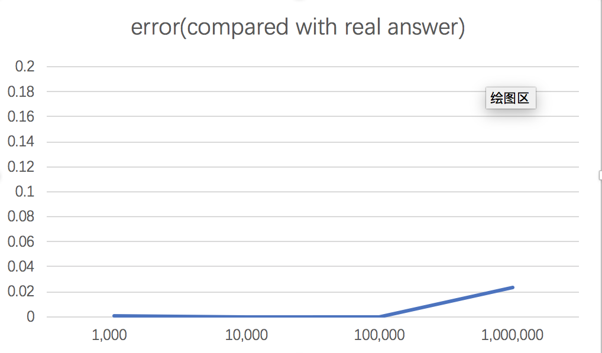

##### 6.5.2.2 Time consumed
From the results showed above, when the N is larger, the time consumed is increased. When the N is very large, it need a lot of time. Compared with the above sampling, it need more time given the same number of samples.
* N = 1000: time consumed = 0.04221320152282715
* N = 10000: time consumed = 0.38462066650390625
* N = 100000: time consumed = 3.595871925354004
* N = 1000000: time consumed = 36.08786201477051


## 7. Algorithms Comparison
### 7.1 Enumeration and Variable Elimination

From the table and graph below, we can discover that after using the variable elimination algorithm, the time consumed is similar but the amount of recursion called is largely decreased from 24 to 3. I think the reason why the time consumed similar is because the aimi-alarm bayesNet is too small and straightforward, which cannot show the big effect of varible elimination.


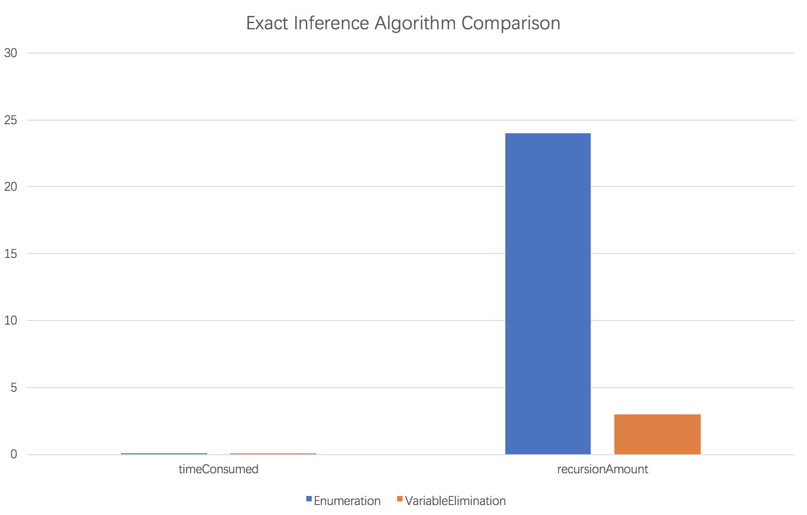

### 7.2 Rejection, Likelyhood weighting and Gibbs sampling
Here I mainly compare the time consumed and error compared with real answer corresponding to different N ranging from 1000, 10000, 100000, 1000000. The error function I take is square of (resultOfTrue - realAnswer).

#### 7.2.1 When N = 1000


1. From the below graph, we can see that when N is small, the Likelyhood weighting and Gibbs sampling are greatly better than rejection sampling.


2. From the below graph, we can see that when N is small, the Gibbs sampling need more time than rejection and likelihood weighting sampling.

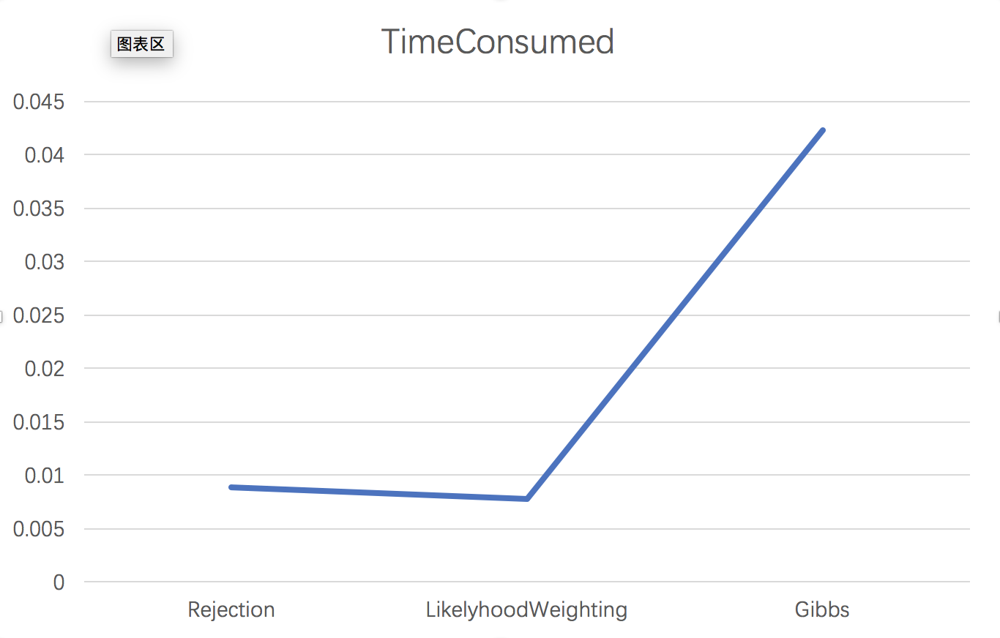

#### 7.2.2 When N = 10000
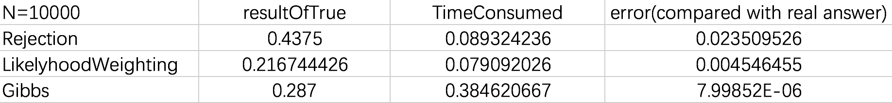

1. From the below graph, we can see that when N is larger, the gibbs sampling has best result, next is Likelyhood weighting, next is rejection sampling.


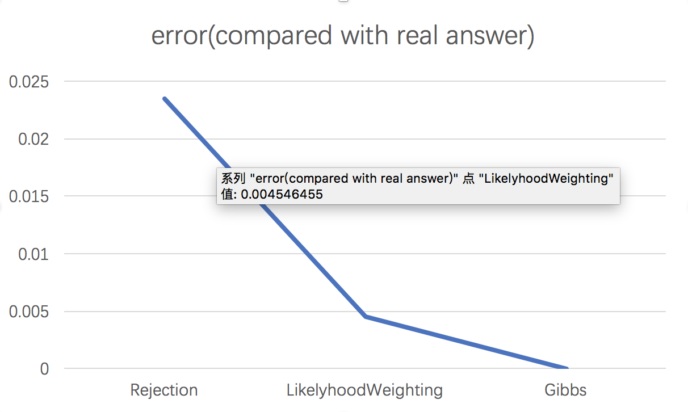

2. From the below graph, we can see that when N is larger, the Gibbs sampling still need more time than rejection and likelihood weighting sampling.


#### 7.2.3 When N = 1000000
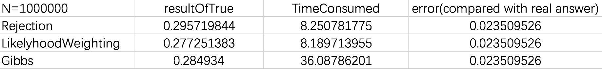

1. From the below graph, we can see that when N is vary large, all 3 algorithms are near the real answer.


2. From the below graph, we can see that when N is vary large, the Gibbs sampling still need much more time(36s) than rejection(8s) and likelihood weighting(8s) sampling.


## 8.Summary

Comparing the time consumed, the mount of recursion called and the error of the result, I made a brief conclusion. The enumeration algorithm can be improved substantially by eliminating repeated calculations of the kind. Variable elimination works by evaluating expressions in right-to-left order. Intermediate results are stored, and summations over each variable are done only for those portions of the expression that depend on the variable.

Rejection sampling is a general method for producing samples from a hard-to-sample distribution given an easy-to-sample distribution. Likelihood weighting avoids the inefficiency of rejection sampling by generating only events that are consistent with the evidence e. It is a particular instance of the general statistical technique of importance sampling, tailored for inference in Bayesian networks. The Gibbs sampling algorithm for Bayesian networks starts with an arbitrary state (with the evidence variables fixed at their observed values) and generates a next state by randomly sampling a value for one of the nonevidence variables Xi.

So when N is small, the Likelyhood weighting and Gibbs sampling are greatly better than rejection sampling. When N is larger, the gibbs sampling has best result, next is Likelyhood weighting, next is rejection sampling. When N is vary large, the Gibbs sampling need much more time than rejection and likelihood weighting sampling.
